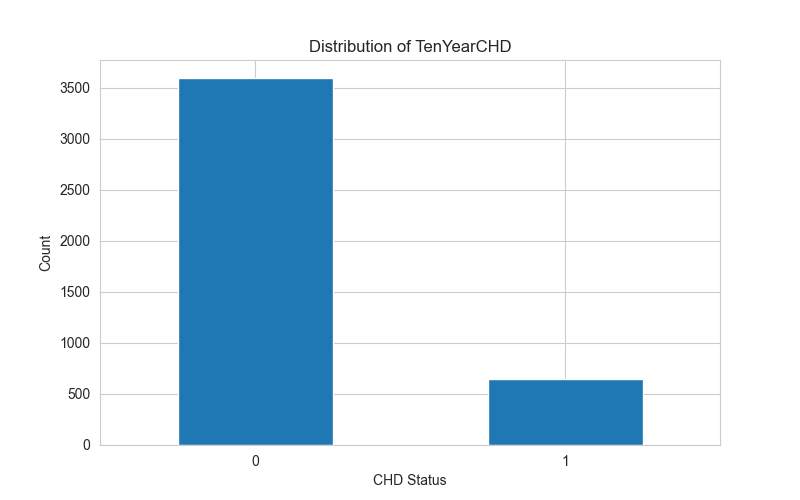
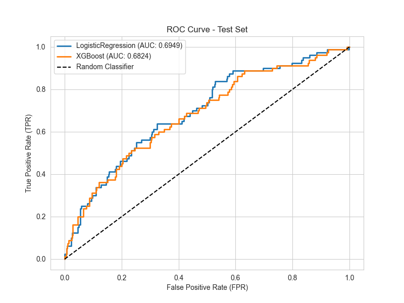
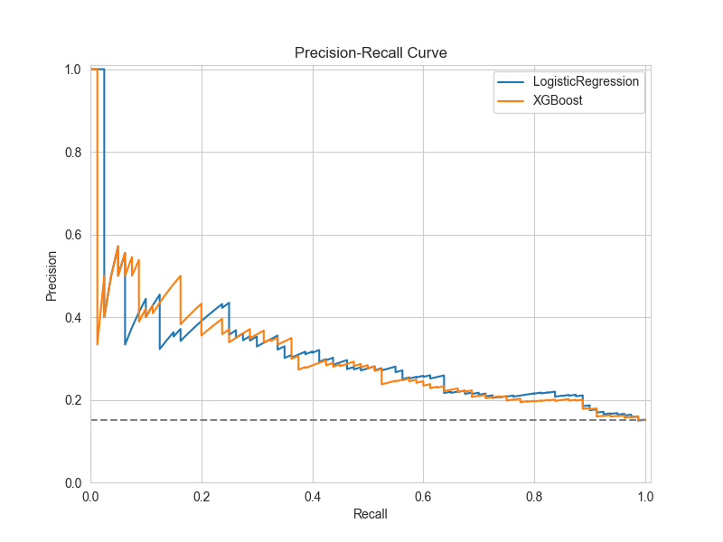
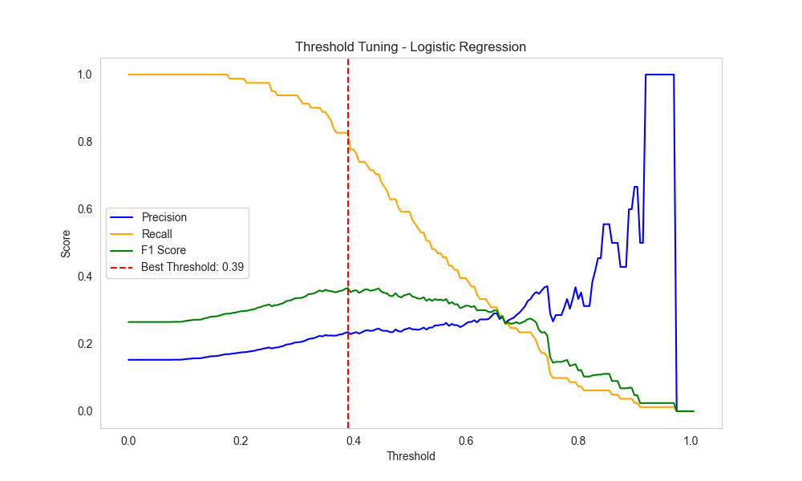
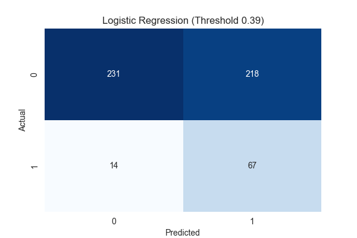
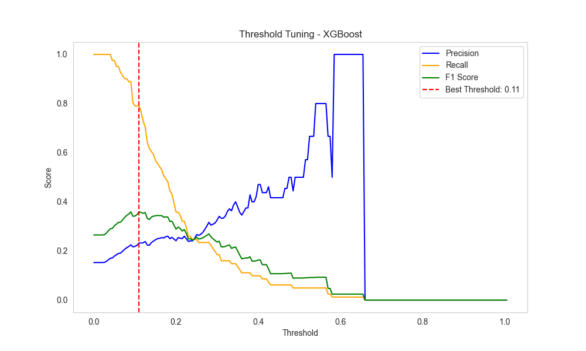
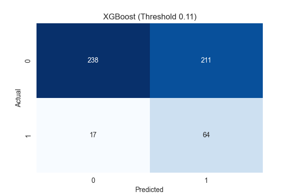
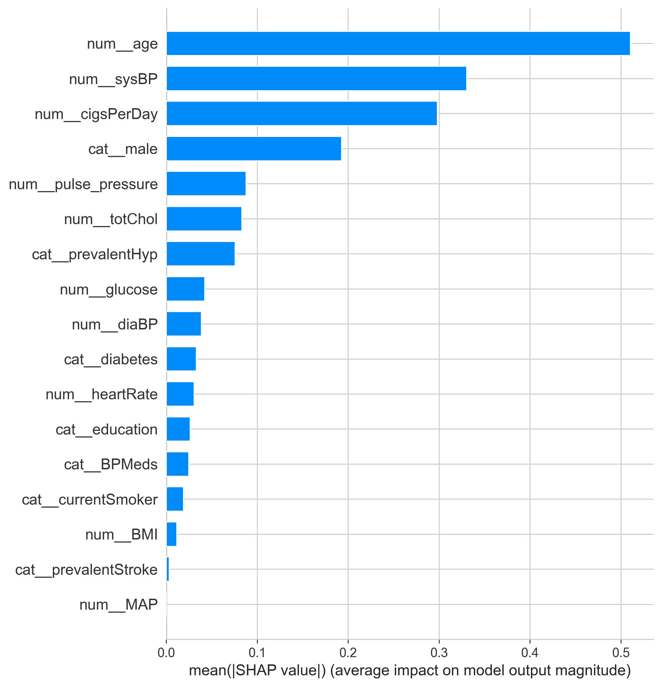
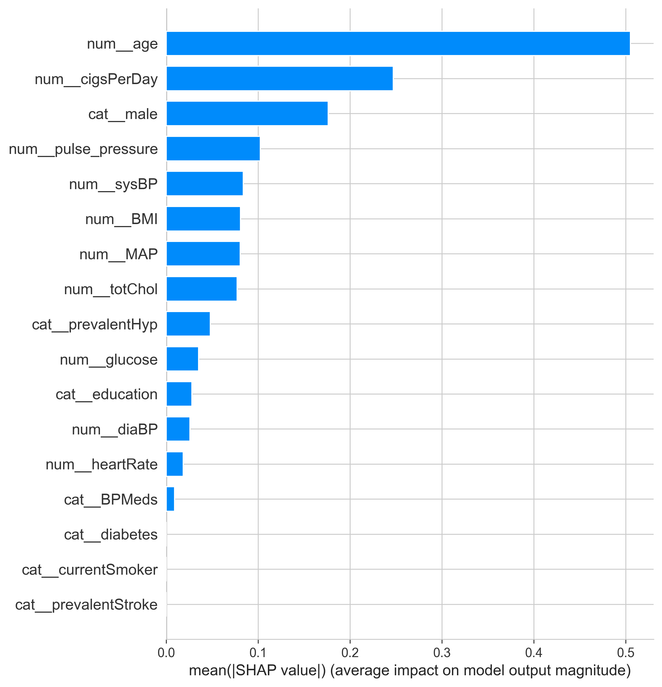

# Framingham Heart Disease Risk Model

A production-style end-to-end machine learning pipeline predicting 10-year coronary heart disease (CHD) risk using a tuned Logistic Regression classifier, served via a FastAPI REST API.

---

## 🔍 Project Overview

This project builds an end-to-end binary classification pipeline to predict a patient's 10-year risk of coronary heart disease using clinical and lifestyle features from the **Framingham Heart Study** dataset:

- Age
- Sex
- Education
- Current Smoker
- Cigarettes Per Day
- Blood Pressure Medication
- Prevalent Stroke
- Prevalent Hypertension
- Diabetes
- Total Cholesterol
- Systolic Blood Pressure
- Diastolic Blood Pressure
- BMI
- Heart Rate
- Glucose



Two models were evaluated:

- Logistic Regression (Champion Model)
- XGBoost

After hyperparameter tuning with 5-fold RandomSearchCV, and optimizing the classification threshold, the champion model achieved:

🏆 **ROC-AUC: 0.6949 | Recall (CHD): 0.7625 | Precision (CHD): 0.2103 | F1-Score: 0.3297 | KS Statistic: 0.3131

---

## Production Pipeline Architecture

The final model is a fully reproducible sklearn pipeline:

```
Pipeline
├── FeatureEngineering()
│   └── Derived features (e.g., MAP, pulse pressure, ratios)
│
├── ColumnTransformer
│   ├── Numerical Pipeline
│   │   ├── Median Imputation
│   │   ├── Winsorization (outlier capping)
│   │   └── Standard Scaling
│   │
│   └── Categorical Pipeline
│       ├── Most Frequent Imputation
│    
└── Logistic Regression (Elastic Net)
    ├── solver = "saga"
    ├── class_weight = "balanced"
    ├── C = 2.077
    └── l1_ratio = 0.632
```
This helps 
* Reduce data leakage
* Apply consistent data transformations and preprocessing

The full model and pipeline are generated and saved to models subfolder with train.py

```python
joblib.dump({
    "pipeline": pipeline,
    "threshold": THRESHOLD,
    "features": NUM_FEATURES + CAT_FEATURES,
    "model_type": "LogisticRegression"
}, MODEL_PATH)
```

## 📁 Repository Structure

```
chd-risk-prediction/
├── app/
│   └── main.py                 # FastAPI app (single + batch prediction)
├── artifacts/
│   ├── confusion_matrix_Logistic_Regression_(Threshold_0.5).png 
|   ├── confusion_matrix_Logistic_Regression_(Threshold_0.39).png 
|   ├── confusion_matrix_XGBoost_(Threshold_0.11).png 
|   ├── confusion_matrix_XGBoost_(Threshold_0.50).png
│   ├── precision_recall_curve_comparison.png
│   ├── roc_curve_comparison.png
│   ├── shap_summary_logreg.png
│   ├── shap_summary_xgb.png
│   ├── ten_year_chd_distribution.png
│   ├── threshold_tuning_plot_0.11.png
│   └── threshold_tuning_plot_0.39.png
├── models/
│   └── chd_risk_model.joblib   # Trained pipeline artifact
├── notebooks/
│   ├── 01_eda.ipynb               # Exploratory data analysis
│   └── 02_modeling.ipynb          # Model training, tuning, and evaluation
├── src/
│   ├── config.py               # Paths, constants, hyperparameters
│   ├── feature_engineering.py  # Custom sklearn feature transformer
│   ├── preprocessing.py        # Pipeline builder
│   └── train.py                # Model retraining script
├── tests/
│   └── test_main.py            # FastAPI endpoint tests
├── requirements.txt            # Development dependencies
└── README.md
```

---

## 🧠 Model Performance

### Model Comparison

| Model | Threshold | ROC-AUC | Precision | Recall | F1-score |
|---|---|---|---|---|---|
| Logistic Regression | 0.39 | 0.6949 | 0.2103 | 0.7625 | 0.3297 |
| XGBoost | 0.11 | 0.6824 | 0.2076 | 0.7500 | 0.3252 |

### KS Statistics (Separation of Score Distributions)

| Model | KS Statistic | p-value |
|---|---|---|
| Logistic Regression | 0.3131 | < 0.0001 |
| XGBoost | 0.2792 | < 0.0001 |

<p align="center">
  
  
</p>

---

## 💡 Methodology

### 1️⃣ Exploratory Data Analysis

- Distribution inspection across all features
- Class imbalance analysis (CHD is a minority class)
- Outlier detection
- Correlation analysis
- Feature Relationships

### 2️⃣ Feature Engineering

Custom sklearn transformer:

Engineered features include:
* Mean Arterial Pressure (MAP)
* Pulse Pressure

### 3️⃣ Model Selection

Penalized Logistic Regression was selected for its performance on test data. It outperforms XGBoost across *ROC-AUC*, *Precision*, *Recall*, *F1-score*, and *KS*.

### 4️⃣ Hyperparameter Tuning

`RandomizedSearchCV` with:
- Stratified K-Fold cross-validation
- Fixed `random_state` for reproducibility
- Optimized for ROC-AUC
- ElasticNet regularization (`saga` solver) for sparse, interpretable coefficients
- Final model retrained on full training data after tuning on validation set

### 5️⃣ Threshold Optimization

Classification threshold was selected based on F1-score performance on a held-out validation set.

- Logistic Regression optimal threshold: **0.39**

<p align="center">
  
  
</p>

- XGBoost optimal threshold: **0.11**

<p align="center">
  
  
</p>

### 6️⃣ SHAP Feature Importance

SHAP analysis was used to interpret model predictions and validate that the model learned clinically meaningful patterns. Plots saved in `artifacts/`.

**Logistic Regression**



**XGBoost**



---

## 🌐 API Reference

The FastAPI app (`app/main.py`) exposes two endpoints:

### `POST /predict` — Single Patient Prediction

**Request body:**
```json
{
  "age": 55,
  "male": 1,
  "education": 2,
  "currentSmoker": 0,
  "cigsPerDay": 0,
  "BPMeds": 1,
  "prevalentStroke": 0,
  "prevalentHyp": 1,
  "diabetes": 0,
  "totChol": 230,
  "sysBP": 140,
  "diaBP": 90,
  "BMI": 28,
  "heartRate": 75,
  "glucose": 95
}
```

**Response:**
```json
{
  "chd_risk_probability": 0.412,
  "chd_risk_prediction": 1
}
```

---

### `POST /predict_batch` — Batch Patient Predictions

**Request body:**
```json
{
  "patients": [
    { "age": 55, "male": 1, ... },
    { "age": 40, "male": 0, ... }
  ]
}
```

**Response:**
```json
{
  "chd_risk_probabilities": [0.412, 0.183],
  "chd_risk_predictions": [1, 0]
}
```

---

## 🚀 Getting Started

**1. Clone the repository**
```bash
git clone https://github.com/melvinadkins/chd-risk-prediction.git
cd chd-risk-prediction
```

**2. Create and activate a virtual environment**
```bash
python -m venv venv
source venv/bin/activate        # Mac/Linux
venv\Scripts\activate           # Windows
```

**3. Install dependencies**
```bash
pip install -r requirements.txt
```

**4. Run the API**
```bash
uvicorn app.main:app --reload
```

The API will be available at `http://127.0.0.1:8000`. Interactive docs at `http://127.0.0.1:8000/docs`.

**5. Retrain the model (optional)**
```bash
python src/train.py
```

---

## 🧪 Running Tests

```bash
pytest tests/test_main.py
```

Tests cover:
- Single prediction endpoint response schema and value ranges
- Batch prediction endpoint response schema and array lengths
- Valid probability bounds `[0, 1]` and binary prediction values `{0, 1}`

---

## 📌 Key Features

- End-to-end sklearn pipeline with preprocessing, feature engineering, and Logistic Regression
- Threshold optimization for clinically appropriate recall/precision tradeoff
- FastAPI application with single and batch prediction endpoints
- Serialized `.joblib` artifact bundling pipeline, threshold, and metadata
- SHAP interpretability analysis
- Reproducible notebooks with clear separation of EDA and modeling
- Pytest-based API test suite

---

*Based on the Framingham Heart Study dataset.*
