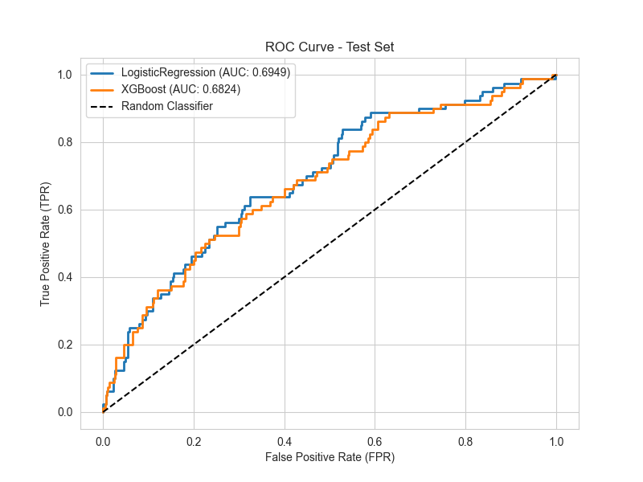
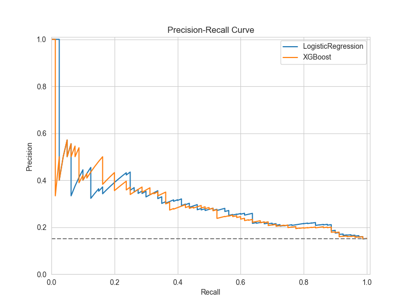
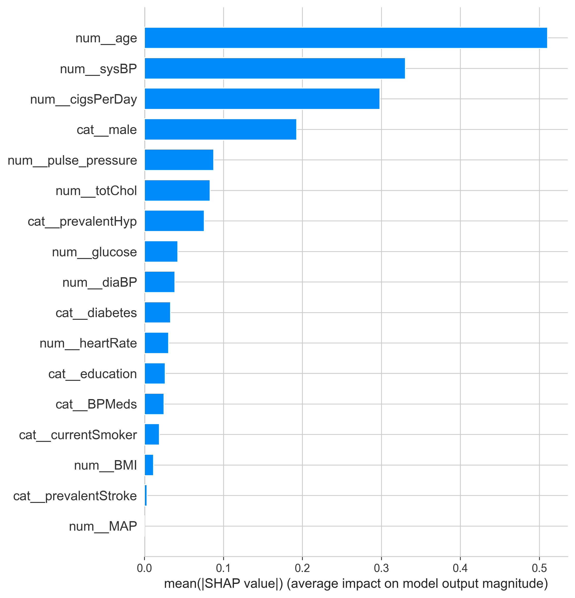
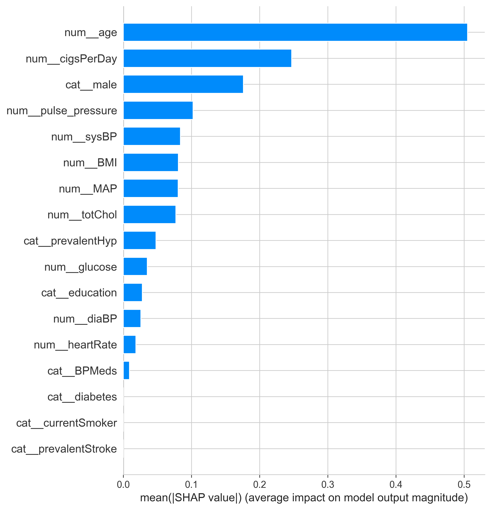

# Framingham Heart Disease Risk Model

Predicting a patient's 10-year risk of coronary heart disease using clinical and lifestyle features from the Framingham Heart Study. The model is deployed as a REST API with single and batch prediction endpoints.

👉 **[Try the live API](https://chd-risk-prediction-api.onrender.com/docs)** — interactive Swagger UI, no setup required

**[Modeling notebook](notebooks/02_modeling.ipynb)** · **[EDA notebook](notebooks/01_eda.ipynb)**

---

## Results

Two models were evaluated. Logistic Regression outperformed XGBoost on both ROC-AUC and KS statistic despite being the simpler model — consistent with the Framingham dataset's relatively small size (~4,000 patients) and the approximately linear relationships between clinical risk factors and CHD incidence.

| Model | Threshold | ROC-AUC | KS Statistic | Recall | Precision | F1 |
|---|---|---|---|---|---|---|
| **Logistic Regression** ✓ | 0.39 | 0.6949 | 0.3131 | 0.7625 | 0.2103 | 0.3297 |
| XGBoost | 0.11 | 0.6824 | 0.2792 | 0.7500 | 0.2076 | 0.3252 |

<p align="center">
  
  
</p>

---

## Why This Problem

CHD is a leading cause of mortality, and the value of a risk model here isn't precision — it's recall. A false negative (missing a high-risk patient) carries a far higher cost than a false positive (flagging someone for follow-up who turns out to be low-risk). That asymmetry drives every major modeling decision in this project, from metric selection to threshold choice.

---

## Modeling Approach

### Simpler model, better results
Logistic Regression was selected as the champion model over XGBoost. With ~4,000 patients and largely linear risk factor relationships — age, blood pressure, and cholesterol compound CHD risk in ways that don't require deep interaction modeling — gradient boosting had more capacity than the data warranted. The ElasticNet penalty (`l1_ratio=0.632`) produces a sparse, interpretable coefficient set, which also aligns with how clinicians reason about risk factors.

### Threshold at 0.39, not 0.50
The default 0.5 threshold optimizes for balanced classification, not clinical utility. At 0.50, the model misses too many true CHD cases — the cost the problem framing is explicitly trying to avoid. Dropping the threshold to 0.39 recovers recall to 0.76 (capturing 3 in 4 true CHD cases) at the cost of lower precision, which is the correct tradeoff for a population screening tool. Threshold was selected on a held-out validation set and evaluated once on a final test set.

### Validation strategy
Hyperparameter tuning (`RandomizedSearchCV`, 5-fold stratified CV) and threshold selection operate on separate data to avoid the common mistake of optimizing both against the same validation set and reporting the result as unbiased. Final metrics reflect held-out test set performance.

---

## Feature Engineering

Two hemodynamic features were derived from raw blood pressure measurements — both are standard clinical biomarkers for cardiovascular risk assessment:

| Feature | Formula | Clinical Relevance |
|---|---|---|
| Mean Arterial Pressure (MAP) | `DBP + (SBP − DBP) / 3` | Average arterial pressure during one cardiac cycle; elevated MAP indicates sustained vascular stress |
| Pulse Pressure | `SBP − DBP` | Difference between systolic and diastolic pressure; a marker of arterial stiffness and an independent CHD predictor |

These were implemented as a custom sklearn transformer (`FeatureEngineering`) that integrates cleanly into the pipeline without leaking statistics across train/test splits.

---

## Interpretability

SHAP analysis validated that the model learned clinically meaningful patterns. Age, systolic blood pressure, total cholesterol, glucose, and cigarettes per day are the strongest predictors — all consistent with established cardiovascular risk literature.

<table align="center">
  <tr>
    <td align="center" width="50%">
      <strong>Logistic Regression</strong><br>
      
    </td>
    <td align="center" width="50%">
      <strong>XGBoost</strong><br>
      
    </td>
  </tr>
</table>

---

## Pipeline Architecture

The final model is a fully reproducible sklearn pipeline, serialized as a `.joblib` artifact bundling the pipeline, threshold, feature list, and model type:

```
Pipeline
├── FeatureEngineering()          # Custom transformer: MAP, pulse pressure
├── ColumnTransformer
│   ├── Numerical: median imputation → Winsorization → standard scaling
│   └── Categorical: most-frequent imputation
└── LogisticRegression
    ├── solver     = "saga"
    ├── penalty    = "elasticnet"
    ├── C          = 2.077
    └── l1_ratio   = 0.632
```

---

## API Reference

Deployed on Render · **[Interactive docs](https://chd-risk-prediction-api.onrender.com/docs)**

### `POST /predict` — Single patient

```json
// Request
{
  "age": 55, "male": 1, "education": 2, "currentSmoker": 0,
  "cigsPerDay": 0, "BPMeds": 1, "prevalentStroke": 0,
  "prevalentHyp": 1, "diabetes": 0, "totChol": 230,
  "sysBP": 140, "diaBP": 90, "BMI": 28, "heartRate": 75, "glucose": 95
}

// Response
{ "chd_risk_probability": 0.412, "chd_risk_prediction": 1 }
```

### `POST /predict_batch` — Batch patients

```json
// Request
{ "patients": [{ "age": 55, "male": 1, ... }, { "age": 40, "male": 0, ... }] }

// Response
{ "chd_risk_probabilities": [0.412, 0.183], "chd_risk_predictions": [1, 0] }
```

---

## Repository Structure

```
chd-risk-prediction/
├── app/
│   └── main.py                 # FastAPI app (single + batch prediction)
├── artifacts/                  # Saved plots: ROC, PR curves, SHAP, confusion matrices
├── models/
│   └── chd_risk_model.joblib   # Serialized pipeline artifact
├── notebooks/
│   ├── 01_eda.ipynb
│   └── 02_modeling.ipynb
├── src/
│   ├── config.py               # Paths, constants, hyperparameters
│   ├── feature_engineering.py  # Custom sklearn transformer
│   ├── preprocessing.py        # Pipeline builder
│   └── train.py                # Retraining script
├── tests/
│   └── test_main.py            # Endpoint tests: schema, value ranges, probability bounds
└── requirements.txt
```

---

## Getting Started

```bash
# Clone and enter the repo
git clone https://github.com/melvinadkins/chd-risk-prediction.git
cd chd-risk-prediction

# Create and activate virtual environment
python -m venv venv
source venv/bin/activate       # Mac/Linux
venv\Scripts\activate          # Windows

# Install dependencies
pip install -r requirements.txt

# Run the API locally
uvicorn app.main:app --reload
# Available at http://127.0.0.1:8000 · Docs at http://127.0.0.1:8000/docs

# Retrain the model
python src/train.py
```

## Running Tests

```bash
pytest tests/test_main.py
```

*Based on the [Framingham Heart Study](https://www.framinghamheartstudy.org/) dataset.*
